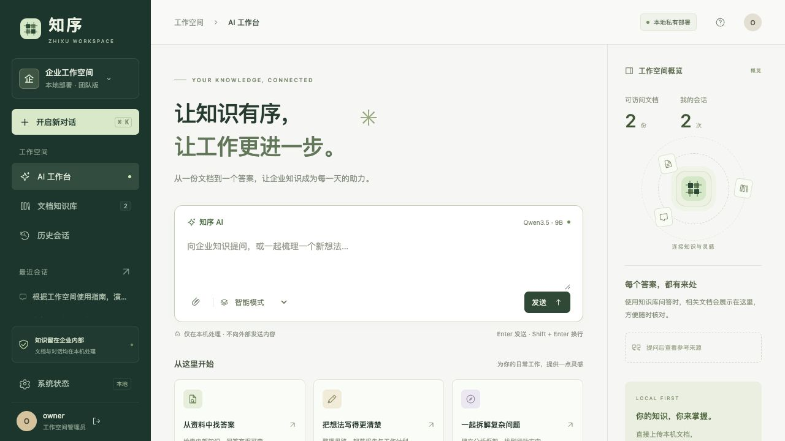

# 知序 · 企业 AI 知识工作台

> 本地优先，数据不离机。基于 Mac M 系列芯片的企业级 AI 工作台，集成文档知识库、流式问答、历史会话与联网搜索，推理与资料处理全程在本机完成。

[](https://www.python.org/)
[](https://www.apple.com/mac/)
[](./pyproject.toml)
[](#)

---



---

## 功能亮点

| 模块 | 说明 |
|---|---|
| **AI 工作台** | 流式问答、AUTO / LOCAL / KNOWLEDGE / WEB 四种回答模式，支持停止与复制 |
| **文档知识库** | 上传 PDF、DOCX、Markdown、TXT 等，BM25 检索，带权限引用溯源 |
| **历史会话** | 自动保存，支持恢复继续提问或导出 Markdown |
| **联网搜索** | 本机 SearXNG + 代理透传，不附带企业资料，搜索词明确提示 |
| **成员与权限** | 多账号、多角色（admin / member）、组级 ACL，网页成员管理 |
| **自动备份** | LaunchAgent 每日备份，SHA256 校验，保留策略自动轮换 |
| **Token 预算** | 生成前真实计数，超限提示缩短或开启新会话，不静默截断 |
| **系统状态** | 模型就绪、请求队列、审计事件、备份状态一屏呈现 |

---

## 技术栈

- **推理**：[llama.cpp](https://github.com/ggerganov/llama.cpp) `llama-server`，本机监听 `127.0.0.1:8080`
- **模型**：Qwen 系列（约 5.68 GB，SHA256 锁定）
- **后端**：Python · FastAPI · uvicorn · SQLite
- **前端**：原生 HTML / CSS / JS，静态资源本地化（marked、DOMPurify），无运行时 CDN
- **搜索**：SearXNG（本机 `127.0.0.1:8888`，Waitress，无 Docker）
- **包管理**：[uv](https://github.com/astral-sh/uv)

---

## 快速开始

### 前置依赖

- macOS，Apple Silicon（M 系列）
- [uv](https://docs.astral.sh/uv/getting-started/installation/)
- Python 3.12 ～ 3.14
- `llama-server`（来自 llama.cpp，支持所选模型）

### 安装与启动

```sh
# 1. 安装依赖
uv sync --locked

# 2. 下载模型（约 5.68 GB，锁定 revision + SHA256 校验）
python3 scripts/download_model.py

# 3. 启动推理服务
python3 scripts/start_model.py --binary /absolute/path/to/llama-server
```

另开终端，**仅首次**初始化账号：

```sh
uv run python -m local_ai create-user owner --role admin --key-file data/owner.key
uv run python -m local_ai ingest --owner owner --visibility public
```

启动网页服务：

```sh
uv run python -m local_ai serve
```

打开 [http://127.0.0.1:9000/](http://127.0.0.1:9000/)，输入 `data/owner.key` 中的密钥登录。

> **已有本机工作区**：直接运行 `启动知序.command`，自动检查模型与搜索服务并打开浏览器。

### 一键启动（macOS）

完成安装后，双击项目根目录的 **`启动知序.command`**。它依次检查本地模型、搜索服务和工作台，等待就绪后打开浏览器。首次安装须在 `config/launcher.local.json` 中设置 `model_binary` 为 `llama-server` 的绝对路径。

```sh
./启动知序.command
.venv/bin/python scripts/start_workspace.py --status
.venv/bin/python scripts/start_workspace.py --no-open
```

---

## 安全与隐私

- 推理服务只监听 `127.0.0.1:8080`，网页服务只监听 `127.0.0.1:9000`
- 普通聊天与知识库问答**不外发**问题或企业资料
- 联网搜索（WEB 模式）需服务端开启 + 账号白名单 + 用户显式触发，三重条件同时满足才发起请求
- 密钥文件仅本机保存，网页通过 HttpOnly Cookie + CSRF 校验，不写入 localStorage
- 账号停用后会话立即失效

---

## 工作台使用

1. 在「文档知识库」上传文件（PDF / DOCX / Markdown / TXT / 常见代码），默认仅自己可见；可预览片段、下载原件、调整共享范围或删除。
2. 在「AI 工作台」选择回答模式，输入问题。回答逐步显示，可停止、复制，点击引用核对原文。
3. 完整回答后自动保存到历史会话，可恢复继续提问或导出 Markdown。
4. 「系统状态」显示模型就绪、请求队列、审计事件和备份状态。

**文件限制**：单文件 5 MB、每账号 200 份 / 100 MB、PDF 150 页、正文 40 万字符；单次最多选 10 个文件，逐个处理。PDF 须有可提取文字，加密 PDF 不支持。

**检索说明**：当前为中文字符/双字与英文标识符 BM25 基线，非语义混合检索；引用列表展示提供给模型的证据，不保证每条均被答案采用。

---

## 联网搜索

启动搜索服务（需另开终端）：

```sh
python3 scripts/start_search.py
```

新环境首次安装搜索依赖：

```sh
python3 scripts/install_search.py
```

搜索仅使用本机 SearXNG（`127.0.0.1:8888`），自动跟随 macOS 系统代理/VPN，不需要 Docker。当前验证 Bing 可用。联网会话保存于本机，网页来源预览保留 30 天。

`config/example.toml` 中关键配置：

```toml
[policy]
allow_web_search = true
allow_cloud_inference = false
allow_private_context_export = false

[web]
searxng_url = "http://127.0.0.1:8888"
allowed_users = ["owner"]
```

> 联网搜索词不是保密通道，请勿填入机密内容。

---

## 成员与权限

```sh
uv run python -m local_ai create-user alice --group engineering --key-file data/alice.key
uv run python -m local_ai set-role alice member
uv run python -m local_ai disable-user alice
```

- 权限覆盖列表、搜索、片段和下载；撤销后历史会话中的来源同步过滤
- 管理员可在「系统状态 → 团队成员」网页修改角色、组和启用状态
- 网页新增账号暂需本机 CLI；SSO 尚未实现

### 密钥轮换

```sh
uv run python -m local_ai rotate-key MEMBER_ID --key-file data/member-replacement.key
```

执行后该账号所有旧密钥和网页会话立即失效，文档与历史记录保留。

---

## 备份与恢复

```sh
# 手动备份
uv run python -m local_ai backup data/backup-unique-name.sqlite3

# 快照 / 校验 / 恢复演练
.venv/bin/python -m local_ai snapshot data/my-backup
.venv/bin/python -m local_ai verify-backup data/my-backup
.venv/bin/python -m local_ai restore-backup data/my-backup data/my-restore

# 强制立即执行一次自动备份
.venv/bin/python scripts/auto_backup.py --force
```

双击 **`备份知序.command`** 可在 `data/backups/` 创建一份带完整性校验的快照。

**自动备份**：本机已安装 LaunchAgent `com.zhixu.workspace.backup`，登录时和每小时检查，距上次成功满 24 小时则创建新备份。管理「系统状态 → 最近自动备份」可查看结果。

```sh
.venv/bin/python scripts/manage_auto_backup.py status   # 查看状态
.venv/bin/python scripts/manage_auto_backup.py install  # 重新安装（路径变更后）
.venv/bin/python scripts/manage_auto_backup.py remove   # 停用定时任务
```

**保留策略**：近 7 天每天最新一份 + 近 28 天每个滚动 7 天区间最新一份，手动备份不自动删除。

> 备份包含上传原件、知识片段、会话与账号认证状态，未加密，请按敏感资料保管。`owner.key` 等原始密钥须单独保管。

---

## 配置

```sh
cp -n config/example.toml config/local.toml
uv run python -m local_ai --config config/local.toml serve
```

配置优先级：`--config` > `LOCAL_AI_CONFIG` 环境变量 > `config/local.toml` > 示例配置。

目录入库（可选）：

```sh
uv run python -m local_ai ingest --owner owner --visibility private
uv run python -m local_ai ingest --owner owner --visibility private --watch-seconds 60
```

支持 `.md .txt .py .c .h .cpp .hpp .rs .yaml .yml`（UTF-8），不扫描 PDF/DOCX。

---

## API

接口使用 `Authorization: Bearer <key>`；网页 Cookie 写操作另需 `X-CSRF-Token`，跨源写入被拒绝。

| 接口 | 用途 |
|---|---|
| `GET /health`、`GET /ready` | 进程健康 / 鉴权后模型就绪检查 |
| `GET /v1/models` | 可用模式列表 |
| `POST /v1/chat/completions` | 文本聊天与 SSE 流式输出 |
| `POST /v1/knowledge/search`、`GET /v1/sources/{id}` | 带权限检索与引用片段 |
| `POST /api/session`、`DELETE /api/session` | 登录 / 退出 |
| `GET /api/me`、`GET /api/workspace` | 当前身份与工作台概览 |
| `GET/POST /api/documents` | 列表、上传（原始二进制，非 multipart） |
| `GET/PATCH/DELETE /api/documents/{id}` | 预览、权限变更、删除 |
| `GET /api/documents/{id}/download` | 下载上传的原件 |
| `GET /api/web-sources/{id}` | 当前账号的网页来源快照 |
| `/api/conversations`、`/api/conversations/{id}` | 会话的增删改查 |
| `GET /api/status` | 模型、队列、审计事件 |

完整契约见 FastAPI 的 `/docs` 页面（服务运行后访问）。

---

## 开发

```sh
# 更新前端静态依赖后重新生成 vendor
npm ci && npm run vendor

# 测试与代码检查
uv run pytest -q
uv run ruff check local_ai scripts tests
uv run ruff format --check local_ai scripts tests
node --check local_ai/static/app.js
npx prettier --check local_ai/static/app.js local_ai/static/app.css local_ai/static/index.html scripts/vendor-ui.mjs
```

自动测试使用模拟推理后端，另含真实 HTTP socket 的取消/断连测试。

---

## 部署边界

这是**可运行的企业本地试点版本**，正式多设备生产部署仍需完成：

- HTTPS / 可信代理配置
- 账号生命周期与 SSO
- 解析进程权限与内存隔离
- 监控告警与持续负载验收
- 离机灾备与加密备份
- launchd 开机自启

当前默认仅监听回环地址，不直接开放公网。远程访问方案见 [docs/remote-access.md](docs/remote-access.md)，详细实施计划见 [总计划书](mac_m4_local_first_ai_v1.md)，已验证与待完成项见 [实施状态](docs/implementation-status.md)。

---

## 目录结构

```
.
├── local_ai/          # 后端核心（FastAPI + 业务逻辑）
│   └── static/        # 前端静态资源（HTML / CSS / JS / vendor）
├── scripts/           # 启动、下载、备份、搜索等运维脚本
├── tests/             # 自动化测试
├── config/            # 配置模板（*.example.toml）
├── docs/              # 设计文档、实施状态、截图
├── data/              # 运行时数据（不纳入版本管理）
└── deploy/            # 远程隧道配置示例
```
